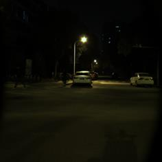

# RGB-IR dataset for 3D detection
Coming soon!
# Data acquisition platform
 
(a) Lidar and camera arrangement. RGB-IR camera setup: (b) Top view, (c) Front view
# Dataset preview
 | RGB |  |  |  |  |
 |:----:| :----:| :----:| :----:| :----:|
 | Infrared |  |  |  |  |
 | 3D Annotation |  |  |  |  |
 

